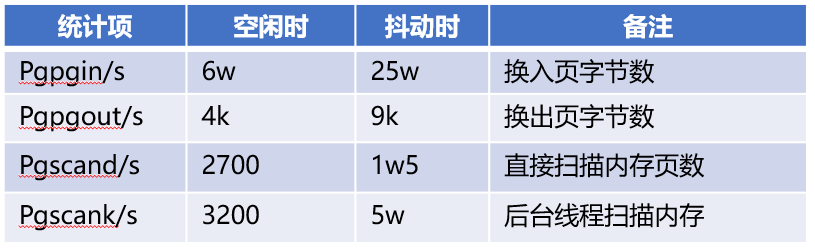
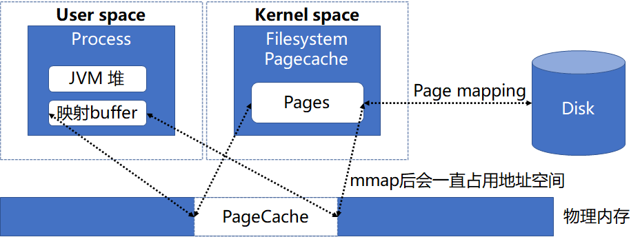

> ElasticSearch 是一个分布式的开源搜索和分析引擎，因其功能强大、简单易用而被应用到很多业务场景。在生产环境使用 ES 时，如果未进行优化则服务的稳定性可能得不到保障，目前我们使用 ES 作为账单平台的基础组件为微信支付提供服务时就遇到这种问题。本文即从当前的业务场景出发，分析 ES 稳定性未到达要求的原因并提供相应的解决思路。

# **一、背景**

微信支付的账单系统是方便用户获取交易记录，针对不同的用户群，账单也分为三类：

- 个人账单：针对普通用户群，这类用户特点是基数大，单个用户数据量小，使用账单系统主要是获取列表以及基础统计；
- 商户账单：针对商户用户群，这类用户特点是基数小，单个用户数据量非常大，使用账单系统主要是获取列表，并且在获取列表时需要支持丰富查询条件；
- 业务账单：针对用户群介于普通用户和商户之间，比如微商或面对面小商户，使用账单系统主要是获取列表以及丰富统计功能；

目前账单平台为微信支付的这三类账单提供写入、存储和查询服务，基本架构如下：

账单平台主要包括两部分：

- 逻辑侧：业务侧直接对接模块，主要是降低业务接入成本，提高接入效率；
- 存储侧：包含 ES 以及接入层 ESProxy，接入层对上屏蔽索引划分机制，方便上层使用；

当前微信支付对整体质量要求非常高，体现在可用性方面是需要达到 99.99%，同样账单平台也需要达到甚至超过该要求。但是在 ES 及系统环境未做优化的情况下，读写成功率是没有达到要求，在个人账单 ES 索引场景下，写成功率为 99.85%，读成功率为 99.95%，所以这里亟需优化。

# **二、内存回收慢优化**

# **问题分析**

针对读写成功率低问题，我们首先查看存储侧接入层 ESProxy 超时失败的情况，对应如下图：

可以看出接入层访问 ES 节点出现了大量超时，在排除接入层自身的问题后，基本上把问题源锁定到 ES 节点。通过进一步确认 ES 节点负载情况（如下图），机器会出现 CPU 抖动，而抖动时上层会出现超时，这就表明读写成功率低是 CPU 抖动导致的，于是我们重心就是解决 CPU 抖动问题。

那么是什么原因导致 ES 节点的 CPU 抖动呢？首先我们先确定 CPU 抖动时系统具体在做什么，根据已有经验，很有可能是 ES 热点线程或 GC 导致的，但是在分析 CPU 抖动时 user 和 system 进程占比情况，其中 user 进程 CPU 占比基本没有变化，而 system 进程 CPU 却增长很多，由于 ES 热点线程或 GC 是 user 进程，所以排除了这里的影响。通过系统相关统计以及 perf 得到下面现象：

- 抖动时系统在大量扫描可回收内存

- 系统在不断进行内存回收

- 系统分配内存时出现了失败

通过这三个现象，我们也得出了一个结论，CPU 抖动是因为内存不足导致。

# **优化方案**

明确了抖动问题原因后，那么我们接下来的优化方向就是保证有足够的空闲内存，避免内存不断回收而出现 CPU 抖动。针对内存不足问题，我们首先确认系统当前的内存分布情况，具体数据如下：

进一步分析如下：

- ES 节点内存主要是被 JVM 以及 PageCache 内存占用
- Jvm 内存是被 java 独占，该部分内存是不会被回收
- PageCache 内存由操作系统维护，该部分内存是可以被回收的

正常情况下，如果系统内存不足，则内核通过回收 PageCache 的内存即可提供足够的空闲内存，即不会内存不足的情况；反过来说，当前出现内存不足，则说明 PageCache 未被正常回收，于是针对内存优化则聚焦到 PageCache 回收问题上。

针对 PageCache 回收问题，首先我们先明确什么因素导致 PageCache 不能及时回收，其中 MMap 就可能导致 PageCache 不能正常回收，原因是 MMap 后应用程序会引用到这部分内存，则内核在回收内存时会忽略这部分内存。而 ES 节点读取文件的方式默认就是 MMap，整体的内存关联关系如下图：

既然 MMap 方式会导致 PageCache 不能及时回收，那么自然考虑是采用其他方式替换 MMap 去访问文件，在 Java 中即可采用 NIO 方式读取文件，对应内存关联关系如下：

采用 NIO 方式访问文件，PageCache 内存只被操作系统维护，则内核可以及时回收 PageCache 以保证足够的内存使用，这样就解决了内存不足问题，进而解决 CPU 抖动问题，从而提高读写成功率；

但是采用 NIO 访问文件也存在问题，即数据会多一次内存复制，会导致延迟方面比 MMap 方式的高，经过测试发现延迟会高 30%左右，这样的结果也不是我们想要的，于是我们考虑将两者结合起来，目的是加快内存回收的同时降低延迟，采取的策略是根据访问频率来确定文件的读写方式（即高频采用 MMap 方式，这样可以保证延迟低，低频采用 Nio 方式，这样可以加快内核回收 PageCache），具体不同文件类型读取方式如下表：

# **优化效果**

采用 MMap+Nio 的方式后，通过测试验证：

- 延迟方面和 MMap 基本一致
- 内存回收方面也比 MMap 好

采用 MMap+Nio 组合方式上线后，对应现网写成功率由 99.85%提升到 99.99%。

# **三、高阶内存优化**

# **问题分析**

在系统运行一段时间后，现网的成功率逐渐降低，由 99.99%降低到 99.97%，对应接入层的超时失败也相应增多，有了之前的经验，我们相应查看了 ES 节点的负载情况，发现仍然有 CPU 抖动的现象（如下图）。考虑到之前已经优化了内存回收慢的问题，此时应是新的问题导致的 CPU 抖动，于是接下来优化点依旧是解决抖动。

和之前分析 CPU 抖动问题一样，我们先确认 CPU 抖动系统在做什么。通过 perf 分析，如下图所示：

采样的结果可以明确 CPU 抖动时，系统在进行内存碎片整合（即有 compact_zone()等函数调用），这就意味着此时系统高阶内存是不足，为了进一步验证当前的高阶内存不足，通过 cat/proc/buddyinfo 查看当前系统空闲内存的分布情况，如下图所示：

分析上面数据可以得出，当前空闲内存有 4G 左右，86%的内存是 0 阶内存，大于等于 2 阶的高阶内存占比只有 4%左右，这里验证当前空闲内存是基本都是碎片化的，碎片化内存示意图如下所示：

# **优化方案**

明确了当前的问题后，那么接下来重点就是考虑将碎片化的内存变成连续内存。前文我们明确了当前 ES 节点的内存主要有两部分组成，分别是 JVM 内存和 PageCache 内存，并且在我们现网环境中，这两部分内存基本上是独立的（当前现网机器内存有两个 NODE，每个 NODE 占了一半的物理内存，其中 JVM 和 PageCache 分布在不同的 NODE 上），这就意味着我们可以只优化 PageCache 间的内存碎片，这样就可以满足我们需求；对应优化流程如下：

具体分为两个步骤：

1、释放内存：释放 PageCache 内存，保证新的空闲内存尽可能连续，具体的处理措施是 echo1 > /proc/sys/vm/drop_cache

2、保留一定空闲内存：目的是避免内存的不断申请和回收，导致内存碎片化再次变得严重，具体处理措施是限制 PageCache 的大小（这里依赖 tlinux 的实现），具体的命令是 echo36 > /proc/sys/vm/pagecache_limit_ratio

# **优化效果**

经过上述的优化之后，系统的空闲内存分布如下：

此时的空闲也是在 4G 左右，但是大于等于 2 阶的高阶内存占比达到 95%左右，即高阶内存当前是非常充足的，并且机器的 CPU 几乎没有抖动（如下图所示）。

在现网进行相应调整之后，读写成功率提升效果如下：

- 写成功率由 99.85%提升到 99.999%
- 读成功率由 99.95%提升到 99.999%

# **四、结论**

针对账单平台的 ES 系统的读写成功率未满足要求，进行了如下优化措施：1、内存回收慢优化：优化 ES 文件读取方式，加快内存回收，降低 CPU 在内存回收方面消耗；2、高阶内存不足优化：整理碎片化内存，保证有充足高阶内存，降低 CPU 在内存碎片整理消耗；

经过上述优化措施后，ES 系统的读写成功率达到 99.999%，超出当前的可用性要求，保障 ES 在生产环境稳定性。