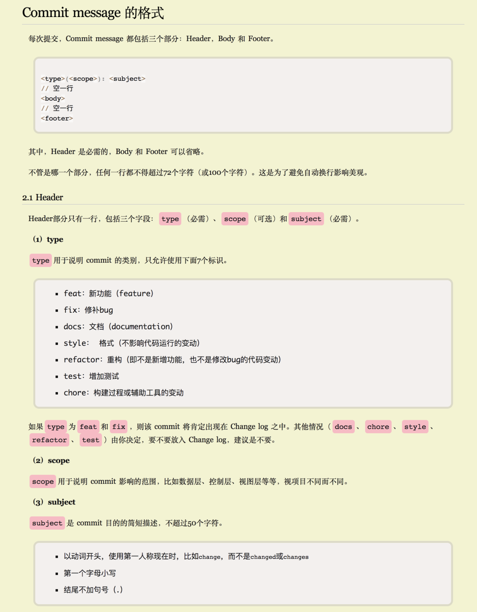
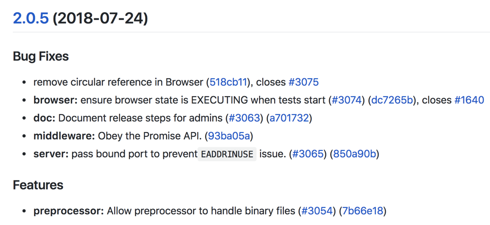

# **参考文档**

- Commit message 提交规范：
  - https://www.conventionalcommits.org/zh-hans
  - https://github.com/angular/angular/blob/master/CONTRIBUTING.md#-commit-message-format
- Commit message 和 Change log 编写指南
  - http://www.ruanyifeng.com/blog/2016/01/commit_message_change_log.html

# **提交格式**



示例：

```
git commit -m "fix(server): pass bound port to prevent`EADDRINUSE` issue."
git commit -m "fix(middleware): Obey the Promise API."
git commit -m "fix(browser): ensure browser state is EXECUTING when tests start"
git commit -m "feat(preprocessor): Allow preprocessor to handle binary files"
git commit -m "chore: release v2.0.5"
```

之后借助 conventional-changelog 工具发布 Change log，将会生成如下内容：

# **未添加 package.json 和 .commitlintrc.js**

在项目根目录下创建或修改文件 package.json：

```
{
  "private": true,
  "version": "0.0.1",
  "scripts": {
    "changelog": "conventional-changelog -p angular -i CHANGELOG.md -s -r 0"
  },
  "gitHooks": {
    "commit-msg": "commitlint -E GIT_PARAMS"
  },
  "devDependencies": {
    "@commitlint/cli": "^8.1.0",
    "cz-conventional-changelog": "^2.1.0",
    "yorkie": "^1.0.3"
  },
  "config": {
    "commitizen": {
      "path": "./node_modules/cz-conventional-changelog"
    }
  }
}
```

在项目根目录下创建配置文件 .commitlintrc.js：

```
// <https://github.com/marionebl/commitlint/blob/master/docs/reference-rules.md>
 
module.exports = {
  rules: {
    'body-leading-blank': [1, 'always'],
    'footer-leading-blank': [1, 'always'],
    'header-max-length': [2, 'always', 72],
    'scope-case': [2, 'always', 'lower-case'],
    'subject-case': [2, 'never', ['start-case', 'pascal-case', 'upper-case']],
    'subject-empty': [2, 'never'],
    'subject-full-stop': [2, 'never', '.'],
    'type-case': [2, 'always', 'lower-case'],
    'type-empty': [2, 'never'],
    'type-enum': [2, 'always', ['build', 'chore', 'ci', 'docs', 'feat', 'fix', 'perf', 'refactor', 'revert', 'style', 'test']]
  }
}
```

# **已配置 package.json 和 .commitlintrc.js**

安装 LTS 版本的 node：https://nodejs.org/en/

然后运行

```
npm install
sudo npm install commitizen conventional-changelog-cli -g
```

此后通过以下方式提交

```
git commit -m "fix(mongo): mongo close bug"     # 非交互式提交，即原生方式
git cz                                          # 交互式提交，即引导式提交
```

生成所有发布的 Change log，运行下面的命令即可

```
npm run changelog
```

# **附录：相关插件**

## **commitlint**

项目地址：https://commitlint.js.org

安装命令：

```
npm install yorkie@^1.0.3 @commitlint/cli --save-dev
```

在项目根目录下创建配置文件 .commitlintrc.js：

```
// <https://github.com/marionebl/commitlint/blob/master/docs/reference-rules.md>
 
module.exports = {
  rules: {
    'body-leading-blank': [1, 'always'],
    'footer-leading-blank': [1, 'always'],
    'header-max-length': [2, 'always', 72],
    'scope-case': [2, 'always', 'lower-case'],
    'subject-case': [2, 'never', ['start-case', 'pascal-case', 'upper-case']],
    'subject-empty': [2, 'never'],
    'subject-full-stop': [2, 'never', '.'],
    'type-case': [2, 'always', 'lower-case'],
    'type-empty': [2, 'never'],
    'type-enum': [2, 'always', ['build', 'chore', 'ci', 'docs', 'feat', 'fix', 'perf', 'refactor', 'revert', 'style', 'test']]
  }
}
```

在 package.json 中配置 gitHooks 字段：

```
{
  "gitHooks": {
    "commit-msg": "commitlint -E GIT_PARAMS"
  }
}
```

之后通过 git commit 提交将会检查 commit message。

## **commitizen**

项目地址：https://github.com/commitizen/cz-cli

安装命令：

```
sudo npm install commitizen -g
commitizen init cz-conventional-changelog --save-dev --save-exact
```

之后使用 git cz 代替 git commit 进行交互式的 commit。

## **changelog**

项目地址：https://github.com/conventional-changelog/conventional-changelog/tree/master/packages/conventional-changelog-cli

安装命令：

```
sudo npm install conventional-changelog-cli -g
```

在 package.json 中配置 version 字段和 changelog 命令：

```
{
  "version": "0.0.1",
  "scripts": {
    "changelog": "conventional-changelog -p angular -i CHANGELOG.md -s -r 0"
  }
}
```

生成所有发布的 Change log，运行下面的命令即可。

```
npm run changelog
```

**注意**：每次执行命令 npm run changelog 发布 Change log 之前，请先修改 package.json 和 pom.xml 文件中的 version 字段为新的版本号x.y.z，如0.6.3。然后执行 npm run changelog 生成 Change log。最后执行 git commit -am "chore: release v0.6.3" 提交后，再创建 tag：git tag v0.6.3 && git push origin v0.6.3。

需要 rc 的版本，需要将 tag 命名为“v0.6.3-rc1”、“v0.6.3-rc2”等，原则上不超过 3 个 rc 版本。